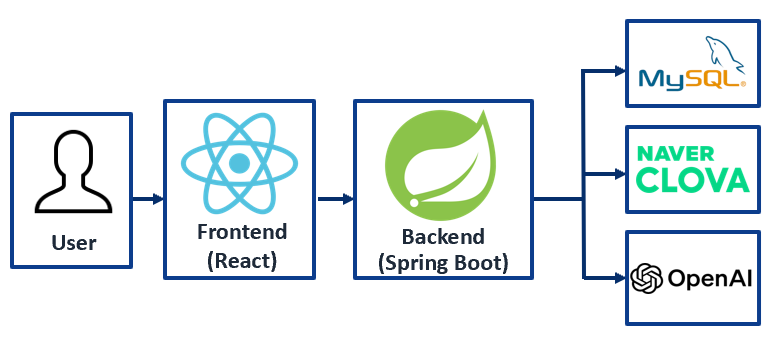

<table>
  <tr>
    <td align="center" width="33%">
      <b>Poster PDF</b> 
      <a href="submission/ITPT_poster.pdf">바로 보기</a>
    </td>
    <td align="center" width="33%">
      <b>시연 영상</b> 
      <a href="https://youtu.be/">바로 보기</a>
    </td>
    <td align="center" width="33%">
      <b>ITPT 링크</b> 
      <a href="https://github.com/CSInterviewProject/ITPT_PUBLIC">바로 가기</a>
    </td>
  </tr>
</table>

---

# ITPT
CS 면접 대비를 위한 웹 서비스.  
질문 제공 → 답변(STT) 기록 → AI 피드백/점수화 → 기록/분석  
흐름으로 연습할 수 있도록 지원합니다.

---

  
<b>Why ITPT? (왜 이 서비스를 만들었는가)</b>

IT 직군 면접에서 CS 질문은 **반복 연습과 피드백**이 핵심이지만, 개인이 꾸준히 연습하기에는 다음과 같은 어려움이 있습니다.

- **즉시 피드백의 부재**: 혼자 답변하면 “어디가 부족한지 / 어떤 키워드가 빠졌는지”를 바로 알기 어렵습니다.
- **기록과 비교의 어려움**: 연습을 하더라도 답변이 쌓이지 않으면 성장(개선) 여부를 객관적으로 확인하기 힘듭니다.
- **면접 환경 재현의 한계**: 실제 면접처럼 시간 제한, 말로 답하기, 긴장감 있는 흐름을 만들기 어렵습니다.
- **분석의 부족**: 어떤 분야(네트워크/OS/DB 등)에 약한지, 점수가 어떻게 변하는지 체계적으로 보기 어렵습니다.

ITPT는 이 문제를 해결하기 위해 만들어졌습니다.  
사용자는 질문을 받고 **말로 답변**하면(STT) 답변이 **자동 기록**되고, AI가 피드백/점수화를 제공하며, 이후에는 기록을 기반으로 분석(추세/카테고리별 약점)까지 확인할 수 있습니다.

즉, ITPT의 목표는 “CS 면접 연습을 **혼자서도 지속 가능하게** 만들고, **피드백과 데이터 기반 개선**이 가능한 연습 환경을 제공하는 것”입니다.

---

  
<b>Architecture</b>

- **Frontend(React + TypeScript)**: 면접 UI/기록/대시보드
- **Backend(Spring Boot)**: 인증/권한, 도메인 로직, DB 접근, STT/LLM 연동 처리
- **Database(MySQL)**: 유저/질문/세션/로그 저장
- **OpenAI API**: 피드백/채점/요약 등 LLM 기능 (현재 Spring 서버에서 직접 호출)

---

  
<b>Badges</b>

---

  
<b>Tech Stack & Why (왜 이 기술을 쓰는가)</b>

### Client (React + TypeScript)

  
  

- **React**
  - 컴포넌트 기반으로 면접 화면(질문/타이머/녹음/피드백/기록)을 빠르게 구성
  - 대시보드/차트 등 UI 확장에 유리
- **TypeScript**
  - 타입 기반으로 런타임 에러를 줄이고(컴파일 단계에서 검출), 리팩토링/확장에 유리
  - API 응답 DTO, 면접 세션/로그 같은 도메인 모델을 타입으로 고정해 협업/유지보수 효율 증가
  - 규모가 커질수록(대시보드/차트/상태관리/권한) 코드 안정성이 크게 올라감
- **Axios**
  - API 호출을 일관된 방식으로 처리(토큰/JWT 헤더 처리, 에러 공통 처리 등에 유리)

---

### API Server (Spring)

  
  
  

- **Spring Boot**
  - REST API 구축을 빠르게 시작(자동설정/내장 서버)하고 운영까지 이어가기 쉬움
  - 인증/DB/배포 등 생태계가 강함
- **Spring Security + JWT**
  - 면접 기록/개인 분석 데이터 보호를 위한 표준 인증/인가 구성
  - 프론트(React)와 분리된 로그인 흐름에 적합
- **Spring Data JPA**
  - 유저/질문/세션/로그를 엔티티로 모델링하고 CRUD를 빠르게 구현
  - 필요 시 복잡한 쿼리로 확장 가능
- **Gradle**
  - 의존성 관리 + 빌드/테스트/패키징 자동화
  - Wrapper로 팀 환경이 달라도 동일한 빌드 보장

---

### STT (Speech To Text)

- **Naver CLOVA Speech (STT)**
  - 음성 답변을 텍스트로 변환 → 저장/평가의 핵심 입력 데이터 생성
  - 한국어 인식에 강점이 있어 면접 답변(STT) 품질 확보에 유리

---

### LLM

- **OpenAI gpt-4.1-mini API**
  - 피드백/채점/요약 생성에 강점
  - 현재는 Spring API 서버에서 직접 호출

---

### Database

  

- **MySQL**
  - 유저/세션/질문/로그 같이 관계형 데이터 구조에 적합
  - JPA 연동이 안정적이고 운영/백업 패턴이 정형화되어 있음

---

## 자료

- 프로젝트 결과물(소스 코드/개발 문서): `client/`, `server/`, `README.md`
- 발표자료 또는 포스터 PDF: [ITPT Poster PDF](submission/ITPT_poster.pdf)
- 프로젝트 결과 보고서 PDF: `submission/ITPT_project_report.pdf` (업로드 예정)
- 시연 영상 링크(YouTube 등): `https://youtu.be/` 형식 링크 추가 예정
